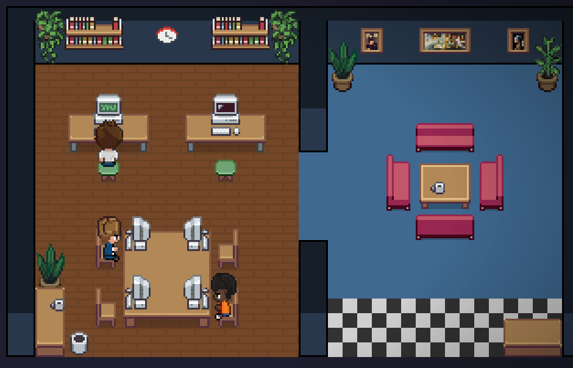
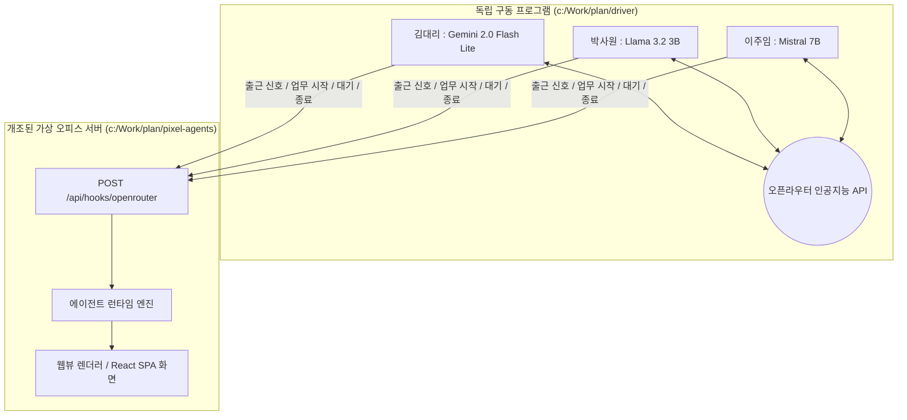

<h1 align="center">
    
    <br/>
    픽셀 에이전트 : 오픈라우터 독립 구동 오피스
</h1>

<h2 align="center" style="padding-bottom: 20px;">
  인공지능 직원들이 스스로 판단하고 일하는 모습을 가상 사무실에서 실시간 관찰하는 플랫폼
</h2>

<div align="center" style="margin-top: 25px;">


</div>

<div align="center" style="margin-top: 15px; margin-bottom: 30px;">
<a href="PLAN_new.md">기획 문서</a> • <a href="walkthrough.md">완료 보고서</a> • <a href="pixel-agents/README.md">원본 프로젝트 안내</a> • <a href="driver/src/config.ts">에이전트 설정</a>
</div>

<div align="center" style="margin-bottom: 30px;">
  
</div>

---

## 📌 프로젝트 소개

이 프로젝트는 오픈소스 가상 사무실 플랫폼인 **[Pixel Agents](https://github.com/pixel-agents-hq/pixel-agents)**를 기반으로 전면 커스터마이징한 개조 버전입니다. 

기존 시스템이 외부 대화 프로그램(Claude Code CLI)의 대화 기록 파일(.jsonl)을 감지하여 수동으로 연동되던 한계를 극복하기 위해, **클로드 명령어 프로그램 없이도 각 가상 직원이 독립적인 오픈라우터(OpenRouter) 인공지능 모델과 직접 통신하며 스스로 행동하는 자율 구동 아키텍처**를 새로 구축했습니다.

단 하나의 실행창(터미널)에서 여러 명의 가상 직원이 비동기 판단 순환 작업을 수행하며, 그 결과 신호가 로컬 웹뷰 서버로 전달되어 귀여운 픽셀 캐릭터 애니메이션(걷기, 문서 읽기, 키보드 타이핑, 휴식 등)으로 즉각 표현됩니다. 또한, 화면 내 모든 버튼과 상태 안내 메시지, 터미널 관찰 일지는 **100% 순수 한글**로 출력됩니다.

---

## 👥 핵심 가상 직원 소개

독립 구동기(`driver`) 안에 탑재된 3명의 인공지능 정규직 참모진입니다. 각기 다른 무료 인공지능 언어 모델이 독립적으로 연결되어 고유한 성격과 업무 스타일을 발휘합니다.

| 이름 | 직급 | 연결된 인공지능 모델 | 주요 업무 및 성격 |
| :---: | :---: | :--- | :--- |
| **김대리** | 대리 | `google/gemini-2.0-flash-lite` | **환경 설정 검토 및 문서화 전문**. 성실하고 꼼꼼한 성격으로 기존 코드나 설정 파일을 묵묵히 읽고 분석하는 작업을 선호합니다. |
| **박사원** | 사원 | `meta-llama/llama-3.2-3b` | **신규 기능 개발 및 소스 수정 전문**. 열정 넘치는 신입 개발자로 소스코드를 적극적으로 편집하고 개선하는 작업을 즐깁니다. |
| **이주임** | 주임 | `mistralai/mistral-7b` | **인프라 및 빌드 시스템 관리 전문**. 빌드 환경을 점검하거나 터미널 실행 명령을 터프하게 돌려보는 작업을 담당합니다. |

---

## 🖥️ 실제 실행 화면 및 구동 모습

### 1. 한글화된 가상 사무실 전체 뷰
웹뷰 하단 버튼(**`배치 편집`**, **`설정`**), 화면 확대/축소 안내 표기 등 영문 텍스트가 전혀 없는 순수 한글 인터페이스 공간에서 세 직원이 각자의 책상에 앉아 열심히 근무하고 있습니다.


### 2. 에이전트 실시간 애니메이션 및 말풍선
에이전트가 인공지능 판단을 내릴 때마다 상태 바가 바뀌며 캐릭터 머리 위에 직관적인 업무 말풍선이 나타납니다.


---

## ✨ 주요 개조 기능 및 시스템 특징

- **독립 오피스 웹 서버 사용 (`pixel-agents/`)**: 외부 NPM 마켓플레이스 패키지에 의존하지 않고 로컬 소스코드를 직접 빌드 및 개조하여 독립 프론트엔드 화면 서버(`http://127.0.0.1:3100`)로 가동합니다.
- **다중 에이전트 자율 판단 루프 (`driver/`)**: 단일 터미널 프로세스 내에서 김대리, 박사원, 이주임이 비동기 타이머에 맞춰 끊임없이 LLM을 호출하고 스스로 다음 업무를 결정합니다.
- **오픈라우터 전용 훅 어댑터 신설**: 서버 측에 신규 어댑터(`openrouter.ts`)와 HTTP 수신부(`POST /api/hooks/openrouter`)를 추가하여 외부 스캐너 없이 메모리 기반으로 캐릭터를 즉시 렌더링합니다.
- **웹뷰 초기 렌더링 동기화 최적화**: 클라이언트 웹뷰의 오피스 가구 배치가 로드 완료된 시점(`layoutReady`)에 에이전트 리스트를 주입하도록 순서를 재조정하여 캐릭터 미노출 현상을 원천 차단했습니다.
- **터미널 컬러 로거 및 순수 한글화**: 실행창에 출력되는 `[시스템]` 태그 및 실시간 한글 업무 일지(`[김대리] 📖 환경 설정 파일을 살펴보고 있어요`)를 통해 내부 사고 과정을 한눈에 파악할 수 있습니다.
- **통신 과부하 에러 자동 회피 (Fallback)**: 오픈라우터 무료 API 호출 한도(429 Rate Limit) 초과 시 서버가 멈추지 않도록 대체 가상 동작을 수행하는 안전장치가 탑재되어 있습니다.

---

## 🏗️ 시스템 아키텍처 및 데이터 흐름



---

## 📂 프로젝트 폴더 구조

```text
c:/Work/plan/
├── README.md               # 프로젝트 통합 안내서 (현재 파일)
├── PLAN_new.md             # 시스템 개조 기획서 및 변경 이력 기록부
├── walkthrough.md          # 최종 완성 및 검증 완료 보고서
│
├── driver/                 # [신규] 오픈라우터 다중 에이전트 독립 구동기
│   ├── package.json        # 구동기 의존성 및 실행 스크립트 설정
│   └── src/
│       ├── index.ts        # 메인 실행 진입점 (출근 알림 및 비동기 루프 시작)
│       ├── agent.ts        # 캐릭터별 무한 자율 판단 상태 머신
│       ├── openrouter.ts   # 오픈라우터 LLM API 통신 및 Fallback 처리기
│       ├── office.ts       # 오피스 서버 HTTP 훅 신호 전송 클라이언트
│       ├── actions.ts      # 도구 사용 결과의 애니메이션 매핑 규칙
│       └── logger.ts       # 터미널 한글 컬러 출력 로거
│
└── pixel-agents/           # [개조] 가상 사무실 백엔드 및 웹뷰 프론트엔드
    ├── package.json        # 프로젝트 통합 컴파일 및 빌드 설정
    ├── server/src/
    │   ├── cli.ts          # 독립 오피스 서버 실행 진입점 (제공자 런타임 교체)
    │   ├── clientMessageHandler.ts # 레이아웃 완료 전후 에이전트 주입 순서 동기화
    │   ├── hookEventHandler.ts     # 세션 시작 신호 시 즉시 캐릭터 생성 로직
    │   └── providers/hook/openrouter/ # 오픈라우터 전용 훅 어댑터 폴더
    └── webview-ui/src/
        ├── hooks/useExtensionMessages.ts # 레이아웃 준비 상태 기반 안전 렌더링
        └── components/     # 도구 모음, 설정 창, 확대/축소 등 100% 한글화된 UI
```

---

## 🚀 시작하기 (실행 방법)

별도의 복잡한 인공지능 CLI 툴을 설치하실 필요 없이 **Node.js (v18 이상)** 환경만 준비되어 있다면 즉시 실행할 수 있습니다.

### 1단계: 프로젝트 소스 컴파일 및 웹뷰 빌드
```powershell
cd c:/Work/plan/pixel-agents
npm install
npm run build
```

### 2단계: 가상 사무실 서버 기동 (터미널 1)
오피스 공간을 호스팅하는 백엔드 서버를 실행합니다.
```powershell
cd c:/Work/plan/pixel-agents
node dist/cli.js
```
*실행 완료 시 웹 브라우저가 자동으로 열리거나 `http://127.0.0.1:3100` 주소에서 아담한 빈 사무실 화면이 준비됩니다.*

### 3단계: 인공지능 직원 출근시키기 (터미널 2)
새 터미널 창을 열어 직원들의 판단 루프를 가동합니다.
```powershell
cd c:/Work/plan/driver
npm start
```
*터미널에 출근 보고 로그가 순차적으로 올라오며, 웹 브라우저 화면 속에 김대리, 박사원, 이주임 캐릭터가 짠하고 등장해 컴퓨터를 두드리기 시작합니다!*

---

## 🛠️ 트러블슈팅 및 문제 해결 가이드

1. **`HTTP 401 Unauthorized` 에러가 발생하며 캐릭터가 나타나지 않을 때**
   - 본 개조 버전에서는 독립 구동기 전송 신호에 대해 보안 토큰 인증을 예외 처리(`httpServer.ts`)해 두었으므로 401 에러가 발생하지 않습니다. 만약 서버를 새로 포크하셨다면 `openrouter` 프로바이더 훅에 대한 Bearer 체크 예외 로직을 확인하세요.
2. **LLM 호출 에러(`429 Too Many Requests`)가 터미널에 뜰 때**
   - 오픈라우터 무료 API의 순간 호출 제한에 걸린 현상입니다. 구동기 내부(`openrouter.ts`)의 안전장치(Fallback)가 자동으로 가상 모의 행동 신호를 서버로 발송하므로 화면상 애니메이션은 멈추지 않고 자연스럽게 계속 작동합니다.
3. **오피스 화면에 책상만 보이고 직원이 안 보일 때**
   - 브라우저에서 `F5` 키를 눌러 웹페이지를 새로고침해 주세요. 초기 렌더링 순서 최적화 로직에 의해 접속 직후 현재 근무 중인 에이전트 목록이 즉시 복원됩니다.

---

## 📝 코드 변경 기록 정책

본 프로젝트의 모든 소스코드 변경 사항은 엄격한 유지보수 규칙에 따라 기획서(`PLAN_new.md`) 하단에 표준 양식으로 기록되고 있습니다.
```text
- [변경] 파일경로 / 이유: 상세한 변경 사유 및 기대 효과
```

---

## 📄 라이선스 (License)

이 프로젝트는 원본 프로젝트와 동일한 **[MIT License](pixel-agents/LICENSE)**를 따릅니다. 누구나 자유롭게 수정하고 활용하실 수 있습니다.
